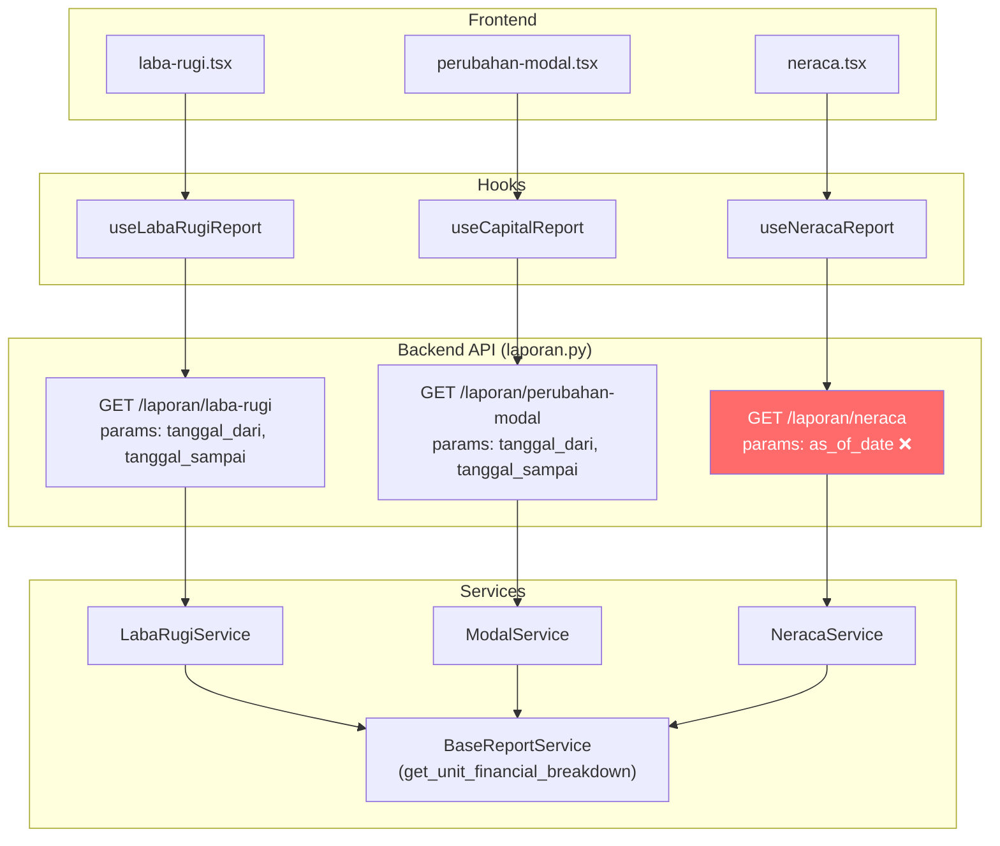

# 🔍 Analisis Sinkronisasi 3 Laporan Keuangan TPM

> [!IMPORTANT]
> Dokumen ini berisi hasil analisis mendalam terhadap **seluruh stack** (Frontend → API → Backend Service → Database Query) untuk mengidentifikasi penyebab utama ketidakseimbangan (unbalanced) dan selisih antara ketiga laporan keuangan.

---

## Arsitektur Data Flow



---

## 🚨 BUG KRITIS #1: Parameter Mismatch Neraca

> [!CAUTION]
> **Frontend mengirim `tanggal_dari` + `tanggal_sampai`, tapi backend Neraca hanya menerima `as_of_date`!**

### Detail

| Layer | Parameter yang Digunakan | Status |
|-------|-------------------------|--------|
| [neraca.tsx](file:///c:/laragon/www/tpm/frontend/app/laporan/neraca.tsx#L60-L74) | `{ tanggal_dari, tanggal_sampai }` | ❌ Salah |
| [keuangan.ts](file:///c:/laragon/www/tpm/frontend/services/keuangan.ts#L496-L502) | `params: { tanggal_dari, tanggal_sampai }` | ❌ Salah |
| [laporan.py](file:///c:/laragon/www/tpm/backend/app/api/v1/laporan.py#L44-L55) | `as_of_date: Optional[date]` | ✅ Benar |
| [neraca_service.py](file:///c:/laragon/www/tpm/backend/app/services/reports/neraca_service.py#L21) | `get_report(self, as_of_date: date)` | ✅ Benar |

**Dampak:** Frontend mengirim `tanggal_dari=2026-04-01&tanggal_sampai=2026-04-28`, tapi backend mengabaikan kedua parameter ini dan menggunakan `date.today()` karena `as_of_date` tidak dikirim. Ini berarti:
1. **Neraca selalu menampilkan data hari ini**, bukan tanggal yang dipilih user
2. **Filter tanggal di UI tidak berfungsi** untuk Neraca

### Fix

```diff
# Frontend: neraca.tsx - getDateParams()
  const getDateParams = () => {
-     let start = date;
-     let end = date;
-     if (filterType === 'monthly') {
-         start = startOfMonth(date);
-         end = endOfMonth(date);
-     } else if (filterType === 'yearly') {
-         start = startOfYear(date);
-         end = endOfYear(date);
-     }
+     let end = date;
+     if (filterType === 'monthly') {
+         end = endOfMonth(date);
+     } else if (filterType === 'yearly') {
+         end = endOfYear(date);
+     }
      return {
-         tanggal_dari: format(start, 'yyyy-MM-dd'),
-         tanggal_sampai: format(end, 'yyyy-MM-dd'),
+         as_of_date: format(end, 'yyyy-MM-dd'),
      };
  };
```

```diff
# Frontend: services/keuangan.ts
  getNeracaReport: async (params?: {
-     tanggal_dari?: string;
-     tanggal_sampai?: string;
+     as_of_date?: string;
  }) => {
      const response = await api.get('/laporan/neraca', { params });
      return response.data;
  },
```

---

## 🚨 BUG KRITIS #2: Neraca Equity = Assets - Liabilities ("By Construction")

> [!WARNING]
> Neraca **tidak pernah bisa unbalanced** di backend saat ini karena Equity di-derive dari `Assets - Liabilities`, bukan dihitung dari komponen modalnya.

### Kode Backend
```python
# neraca_service.py line 152-153
total_equity = total_assets - total_liabilities  # ← Always balanced by construction!
```

**Masalah:** Ini berarti `selisih` akan SELALU mendekati 0 (dalam toleransi `< 100`). Neraca tampak balanced padahal **breakdown komponennya bisa salah**. Misalnya:
- `setoran_modal + laba_ditahan - prive` ≠ actual equity yang ditampilkan
- `modal_komponen` (line 230) di-set ke `total_equity` yang di-derive, bukan dari kalkulasi bottom-up

**Ini menutupi masalah sebenarnya** — user tidak bisa mendeteksi jika ada komponen modal yang salah.

### Rekomendasi Fix

Hitung equity dari komponen bottom-up, lalu bandingkan dengan `Assets - Liabilities`:

```python
# Hitung equity dari komponen
equity_from_components = setoran_modal + retained_earnings - prive_total
# Hitung equity dari balance sheet identity
equity_from_identity = total_assets - total_liabilities
# Selisih yang sesungguhnya
real_selisih = equity_from_components - equity_from_identity
```

---

## 🚨 BUG KRITIS #3: Definisi Laba Berbeda di Setiap Laporan

### Perbandingan Kalkulasi `Laba Bersih`

| Komponen | Laba Rugi | Perubahan Modal | Neraca |
|----------|----------|-----------------|--------|
| **Method** | `LabaRugiService.get_report()` | `ModalService.get_report()` | `NeracaService.get_report()` |
| **Laba Bengkel** | `laba_kotor - gaji - ops` | `b.laba_kotor` (Gross!) | via `retained_earnings` |
| **Laba Mobil** | `revenue - hpp - repairs - prep - overhead - sharing` | `m.total_laba_kotor` (Gross!) | via `retained_earnings` |
| **Laba JA** | `revenue_gross - maintenance - ops - overhead` | `ja.revenue_gross` or `revenue_tpm` | via `retained_earnings` |
| **Prive** | Dikurangi dari laba_bersih | Ada di Section C | Dikurangi dari modal |
| **Beban Umum** | Dikurangi | Ada di Section C operasional | via `retained_earnings` |

> [!CAUTION]
> **Laba Rugi menghitung Laba BERSIH (setelah beban), tapi Perubahan Modal menggunakan Laba KOTOR sebagai `period_profit`!** Beban operasional kemudian dikurangi terpisah di Section C. Ini membuat angkanya **tampak berbeda** meskipun secara matematika seharusnya setara.

### Detail Issue:
```python
# modal_service.py line 90-93
laba_bengkel = float(b.get("laba_kotor", 0))        # KOTOR, bukan bersih!
laba_mobil_gross = float(m.get("total_laba_kotor", 0))  # KOTOR
laba_ja = float(ja.get("revenue_gross", 0))           # Revenue, bukan laba!
```

Sedangkan di Laba Rugi:
```python
# laba_rugi_service.py line 21
b_laba_bersih = b_laba_kotor - b_gaji - b_ops  # BERSIH
```

### Persamaan yang HARUS Berlaku:

```
Laba Bersih (Laba Rugi) = period_profit (Modal) - total_c (Modal)
                        = retained_earnings (Neraca) - prive_in_current_period
```

Saat ini ini **TIDAK dijamin** karena `retained_earnings` di Neraca dihitung oleh `BaseReportService.get_unit_financial_breakdown()` dengan formula yang berbeda lagi:

```python
# base.py line 480
"retained_earnings": total_laba_gross - internal_elimination - total_operasional
```

---

## 🚨 BUG KRITIS #4: Neraca `retained_earnings` vs Laba Rugi `laba_bersih`

### Perbandingan Formula

**Neraca** (via `base.py`):
```python
retained_earnings = total_laba_gross - internal_elimination - total_operasional
# dimana:
total_laba_gross = laba_mobil_tpm + laba_bengkel_kotor + laba_ja_tpm
total_operasional = bengkel_ops + bengkel_common + ja_trip + ja_wallet + ja_overhead + ...
```

**Laba Rugi** (via `laba_rugi_service.py`):
```python
laba_bersih_akhir = (b_laba_bersih + ja_laba_bersih + m_laba_bersih - overhead_pusat) - prive
# dimana:
b_laba_bersih = laba_kotor - gaji - ops  # Includes GAJI
m_laba_bersih = revenue - hpp - maintenance - prep - overhead - sharing  # Includes SHARING
```

> [!WARNING]
> **Perbedaan krusial:**
> 1. **Gaji:** Laba Rugi mengurangi gaji dari laba bengkel (`b_gaji`), tapi `retained_earnings` di base.py TIDAK mengurangi gaji!
> 2. **Investor Sharing:** Laba Rugi mengurangi `sharing_investor` dari laba mobil, tapi `retained_earnings` menggunakan `laba_mobil_tpm` yang sudah net dari sharing.
> 3. **Prive:** Laba Rugi mengurangi prive dari `laba_bersih`, tapi Neraca TIDAK mengurangi prive dari `retained_earnings` (dikurangi terpisah di equity).

**Ini adalah SUMBER UTAMA ketidakseimbangan** jika gaji tidak dimasukkan ke `total_operasional` di base.py.

---

## 📋 Checklist Sinkronisasi (Urutan Prioritas)

### Prioritas 1: Fix Parameter Neraca
- [ ] Fix `neraca.tsx` → kirim `as_of_date` bukan `tanggal_dari/tanggal_sampai`
- [ ] Fix `keuangan.ts` → update type signature `getNeracaReport`

### Prioritas 2: Standarisasi Definisi Laba
- [ ] Pastikan `retained_earnings` di `base.py` **SUDAH mengurangi gaji**
- [ ] Verifikasi bahwa `retained_earnings` = `laba_bersih_akhir` (Laba Rugi) + `prive`
- [ ] Tambahkan unit test: `LabaRugiService.laba_bersih + prive == NeracaService.retained_earnings`

### Prioritas 3: Neraca Bottom-Up Equity
- [ ] Hitung `total_modal` dari komponen: `setoran_modal + retained_earnings - prive`
- [ ] Bandingkan dengan `total_assets - total_liabilities` → ini yang jadi `selisih` sebenarnya
- [ ] Hapus `total_equity = total_assets - total_liabilities` dan ganti dengan kalkulasi bottom-up

### Prioritas 4: Cross-Validation Kas
- [ ] Pastikan `cash + transfer` (Section D Modal) = `kas_tunai + kas_bank + unit_cash` (Aktiva Lancar Neraca)
- [ ] Kedua service query `KasBankJenis` dengan cara yang sama (✅ sudah konsisten)

### Prioritas 5: Frontend Consistency
- [ ] Ketiga laporan harus menggunakan **range tanggal yang identik** saat dipanggil bersamaan
- [ ] Neraca `as_of_date` = `tanggal_sampai` dari Laba Rugi dan Perubahan Modal
- [ ] Tambahkan cross-check indicator di UI: "Laba Ditahan = Rp X (dari Laba Rugi)"

---

## 🔧 Ringkasan Bug Per File

| File | Bug | Severity |
|------|-----|----------|
| [neraca.tsx](file:///c:/laragon/www/tpm/frontend/app/laporan/neraca.tsx#L60-L74) | Kirim `tanggal_dari/tanggal_sampai` padahal backend butuh `as_of_date` | 🔴 Critical |
| [keuangan.ts](file:///c:/laragon/www/tpm/frontend/services/keuangan.ts#L496-L502) | Type signature tidak match dengan backend API | 🔴 Critical |
| [neraca_service.py](file:///c:/laragon/www/tpm/backend/app/services/reports/neraca_service.py#L152-L153) | `total_equity = total_assets - total_liabilities` menutupi selisih asli | 🟡 High |
| [base.py](file:///c:/laragon/www/tpm/backend/app/services/reports/base.py#L470-L481) | `retained_earnings` mungkin tidak konsisten dengan Laba Rugi (gaji?) | 🟡 High |
| [modal_service.py](file:///c:/laragon/www/tpm/backend/app/services/reports/modal_service.py#L90-L93) | Menggunakan `laba_kotor` bukan `laba_bersih` (by design tapi confusing) | 🟢 Medium |
| [perubahan-modal.tsx](file:///c:/laragon/www/tpm/frontend/app/laporan/perubahan-modal.tsx) | `penyesuaian` fallback menyembunyikan discrepancy | 🟢 Medium |

---

## 🎯 Rekomendasi Implementasi

### Opsi A: Quick Fix (Minimum Effort)
1. Fix parameter Neraca (frontend only)
2. Verifikasi `retained_earnings` sudah benar di base.py
3. Tidak mengubah arsitektur backend

### Opsi B: Proper Fix (Recommended)
1. Fix parameter Neraca
2. Buat `retained_earnings` di base.py konsisten dengan Laba Rugi
3. Ubah Neraca equity ke bottom-up calculation
4. Tambahkan cross-validation endpoint `/laporan/validate`
5. Tampilkan indicator sinkronisasi di frontend

> [!TIP]
> **Langkah pertama yang bisa langsung dilakukan:** Fix Bug #1 (parameter mismatch) karena ini adalah perbaikan frontend-only yang tidak membutuhkan perubahan backend dan bisa langsung menyelesaikan masalah filter tanggal.
