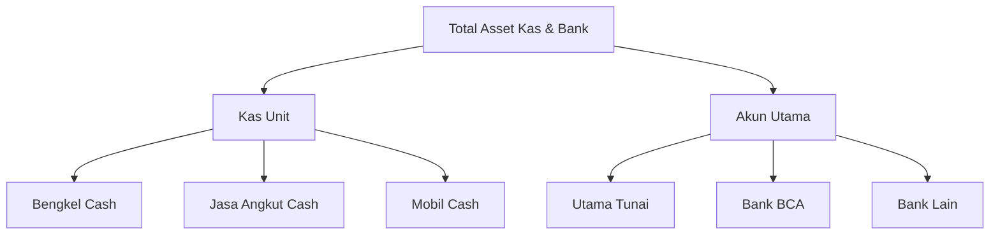

# Pelan Implementasi Alur Keuangan Baru

Dokumen ini merinci perubahan arsitektur dan logika yang diperlukan untuk beralih dari satu kas umum ke **Alur Keuangan Per-Unit (Siloed)** dengan satu **Akun Utama (Pusat)**.

## 1. Ikhtisar (Overview)
Struktur keuangan TPM Super App akan dibagi menjadi 4 pilar utama:
1. **Unit Bengkel**: Akun Kas khusus untuk pendapatan servis dan penjualan spare part.
2. **Unit Jasa Angkut**: Akun Kas khusus untuk pendapatan ritase/muatan.
3. **Unit Showroom/Mobil**: Akun Kas khusus untuk uang muka (DP) dan biaya operasional mobil.
4. **Akun Utama (Pusat)**: Hub pusat yang memegang saldo **Tunai** dan **Transfer/Bank**. Semua kelebihan kas dari unit dipindahkan ke sini.

---

## 2. Perubahan Struktur Inti

### 2.1 Konstanta Backend (`app/utils/constants.py`)
Kita akan menambahkan nilai baru pada `KasBankJenis`:

```python
class KasBankJenis(str, Enum):
    # --- Kas Unit (Hanya Cash) ---
    KAS_UNIT_BENGKEL = "KAS_UNIT_BENGKEL"
    KAS_UNIT_JASA_ANGKUT = "KAS_UNIT_JASA_ANGKUT"
    KAS_UNIT_SHOWROOM = "KAS_UNIT_SHOWROOM"

    # --- Akun Utama (Pusat) ---
    KAS_UTAMA = "KAS_UTAMA"
    BANK_UTAMA_BCA = "BANK_UTAMA_BCA"
    # (Bank lain tetap bisa digunakan sebagai bagian dari Utama)
```

### 2.2 Logika Aliran Data
Transaksi akan otomatis diarahkan berdasarkan sumbernya:
| Sumber Transaksi | Target Dompet (Default) | Metode |
| :--- | :--- | :--- |
| Pendapatan Bengkel | `KAS_UNIT_BENGKEL` | Tunai |
| Ritase Jasa Angkut | `KAS_UNIT_JASA_ANGKUT` | Tunai |
| Penjualan Mobil (DP) | `KAS_UNIT_SHOWROOM` | Tunai |
| Operasional Umum | `KAS_UTAMA` / `BANK_UTAMA` | Tunai/Transfer |

---

## 3. Mekanisme "Setoran ke Pusat" (Internal Transfer)

Kita akan memanfaatkan metode `KasBankService.transfer()` yang sudah ada.

### Alur Proses:
1. **Sumber**: Pilih kas unit (misal: `KAS_UNIT_BENGKEL`).
2. **Target**: Pilih `KAS_UTAMA` atau akun bank.
3. **Transaksi**:
   - Sistem mencatat **Kas Keluar** dari unit.
   - Sistem mencatat **Kas Masuk** ke Akun Utama.
   - Kedua transaksi otomatis terhubung melalui `nomor_referensi`.

---

## 4. Refaktor Dashboard (`app/api/v1/dashboard.py`)

Laporan **Neraca** dan **Dashboard** akan mengelompokkan kas berdasarkan Unit vs Pusat:



---

## 5. Rencana Kerja (Implementation roadmap)

### Fase 1: Fondasi Inti
- [ ] Tambahkan nilai `KasBankJenis` baru di `constants.py`.
- [ ] Siapkan script inisialisasi saldo awal untuk dompet baru.

### Fase 2: Integrasi Logika
- [ ] Update hooks Pendapatan Bengkel ke `KAS_UNIT_BENGKEL`.
- [ ] Update hooks Jasa Angkut ke `KAS_UNIT_JASA_ANGKUT`.
- [ ] Update hooks Showroom ke `KAS_UNIT_SHOWROOM`.

### Fase 3: Dashboard & Pelaporan
- [ ] Refaktor endpoint `get_neraca` untuk pengelompokan saldo.
- [ ] Update komponen `WalletSection` di mobile App.

### Fase 4: Antarmuka UI "Setoran"
- [ ] Buat Modal "Setoran ke Pusat" di aplikasi mobile.
- [ ] Hubungkan dengan API `transfer` yang sudah ada.

---

> [!IMPORTANT]
> **Catatan Migrasi**: Transaksi lama yang ada di kategori `CASH` umum perlu dipetakan ulang atau akun `CASH` tersebut akan dijadikan default `KAS_UTAMA`.

**Apakah Anda setuju dengan rencana ini?** Jika ya, saya akan segera memulai tahap pertama.
